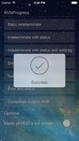
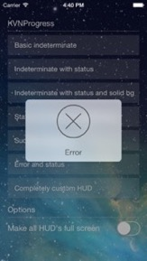
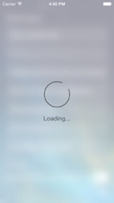
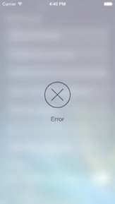
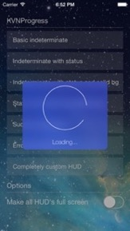
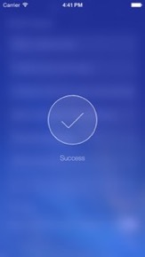
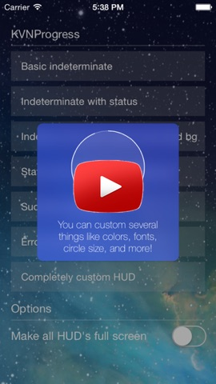

##KVNProgress

[](https://twitter.com/kevinh6113)
[](https://github.com/kevin-hirsch/KVNProgress/blob/master/README.md)
[](https://github.com/kevin-hirsch/KVNProgress)

KVNProgress is a fully customizable progress HUD that can be full screen or not.
***
Base interface:<br/>
[](Images/screenshot_002.jpg)
[](Images/screenshot_003.jpg)
[](Images/screenshot_004.jpg)
[](Images/screenshot_005.jpg)
<br/>
Full screen interface:<br/>
[](Images/screenshot_007.jpg)
[](Images/screenshot_008.jpg)
[](Images/screenshot_009.jpg)
[](Images/screenshot_010.jpg)
<br/>
Example of customized interface:<br/>
[](Images/screenshot_013.jpg)
[](Images/screenshot_006.jpg)
[](Images/screenshot_011.jpg)
[](Images/screenshot_012.jpg)

## Advantages

 * Can be full screen
 * Uses `UIMotionEffect`
 * Animates text update
 * Animates success checkmark
 * Is well documented
 * Is fully customizable
    * Colors
    * Fonts
    * Circle size and thickness

## Demo

Here is a video of the demo app that you can find in this project.

[](https://www.youtube.com/watch?v=aerOmPYG_NI)

## Requirements

* Xcode 5
* iOS 7
* ARC
* Frameworks:
    * QuartzCore
    * GLKit

## Installation

### Cocoapods

[CocoaPods](http://www.cocoapods.org) recommended to use KVNProgress.

1. Add `pod 'KVNProgress'` to your *Podfile*.
2. Install the pod(s) by running `pod install`.
3. Include KVNProgress wherever you need it with `#import <KVNProgress/KVNProgress.h>`.


### Source files

1. Download the [latest code version](http://github.com/kevin-hirsch/KVNProgress/archive/master.zip) or add the repository as a git submodule to your git-tracked project.
2. Drag and drop the **Classes**, **Categories** and also the **Resources** directory from the archive in your project navigator. Make sure to select *Copy items* when asked if you extracted the code archive outside of your project.
3. Include KVNProgress wherever you need it with `#import <KVNProgress/KVNProgress.h>`.

## Usage

Check out the provided demo app for many examples how you can use the components.

### Basics

KVNProgress HUD will block the user from interacting with the interface behind it.
You can customize colors, font and size of the HUD.

Add the following import to the top of the file or to your Prefix header:

   ```objc
   #import <KVNProgress/KVNProgress.h>
   ```

### Indeterminate progress

To show an indeterminate progress:

   ```objc
   [KVNProgress show];
   
   // Adds a status below the progress
   [KVNProgress showWithStatus:@"Loading"];
   ```

To change the status on the fly (animated):

  ```objc
   [KVNProgress updateStatus:@"New status"];
   ```

### Determinate progress

To show a determinate progress and change its value along time:

   ```objc
   // Progress has to be between 0 and 1
   [KVNProgress showProgress:0.5f];
   
   // Adds a status below the progress
   [KVNProgress showProgress:0.5f
                      status:@"Loading"];
   
   // Updates the progress
   [KVNProgress updateProgress:0.75f
                      animated:YES];
   ```

### Dismiss

To dismiss after your task is done:

   ```objc
   // Dismiss
   [KVNProgress dismiss];
   ```

**When necessary, you can use:**

   ```objc
   // Dismiss
   [KVNProgress dismissWithCompletion:^{
      // Things you want to do after the HUD is gone.
   }];
   ```

**Why?**

Because KVNProgress remains visible for a certain time even if you call `dismiss`. This is done to ensure the user has enough time to see the HUD if the load is too quick.
The completion block in `dismissWithCompletion` is called (on the main thread) after the HUD is completely dismissed.
This amount of time is defined in `KVNProgress.h` in a static variable `KVNMinimumDisplayTime`. Feel free to change it to suits your needs! Default value is `0.3` seconds.

### Success/Errors

To show a success HUD with a checkmark:

   ```objc
   [KVNProgress showSuccess];
   
   // Or
   [KVNProgress showSuccessWithStatus:@"Success"];
   ```

To show an error HUD with a cross:

   ```objc
   [KVNProgress showError];
   
   // Or
   [KVNProgress showErrorWithStatus:@"Error"];
   ```

Dismiss is automatic for successes and errors.

## Customization

The appearance of KVNProgress is very customizable. 
If something is missing or could be added, don't hesitate to ask for it!

### UIAppearance

You can setup your HUD UI in your UI setups for your app using:

  ```objc
   // The color of the status
   [KVNProgress appearance].statusColor = [UIColor darkGrayColor];
   
   // The font of the status
   [KVNProgress appearance].statusFont = [UIFont systemFontOfSize:17.0f];
   
   // The stroke color of the circle that will be animated (for a (in)determinate progress)
   [KVNProgress appearance].circleStrokeForegroundColor = [UIColor darkGrayColor];
   
   // The stroke color of the circle background when (and only when) animating a determinate progress
   [KVNProgress appearance].circleStrokeBackgroundColor = [[UIColor darkGrayColor] colorWithAlphaComponent:0.3f];
   
   // The inner background of the circle
   [KVNProgress appearance].circleFillBackgroundColor = [UIColor clearColor];
   
   // The background color of the HUD (only when using solid color background)
   [KVNProgress appearance].backgroundFillColor = [UIColor colorWithWhite:0.9f alpha:0.9f];
   
   // The background color of the HUD (only when using blurred background)
   [KVNProgress appearance].backgroundTintColor = [UIColor whiteColor];
   
   // The color of the success checkmark and its circle
   [KVNProgress appearance].successColor = [UIColor darkGrayColor];
   
   // The color of the error cross and its circle
   [KVNProgress appearance].errorColor = [UIColor darkGrayColor];
   
   // The size of the circle
   [KVNProgress appearance].circleSize = 75.0f;
   
   // The line width of the circle's stroke, checkmark and cross
   [KVNProgress appearance].lineWidth = 2.0f;
   ```

### Parameters

You can pass more parameters to the `show`, `showProgress:`, `showSuccess` and `showError` methods by calling these methods:

   ```objc
   + (void)showWithParameters:(NSDictionary *)parameters;
   + (void)showProgress:(CGFloat)progress
             parameters:(NSDictionary *)parameters;
   + (void)showSuccessWithParameters:(NSDictionary *)parameters;
   + (void)showErrorWithParameters:(NSDictionary *)parameters;
   ```

Here are the parameter keys constants you can use:

| Constant | Value | Description |
|------------------------------------------|------------------------------------------------------------------------------------|------------------------------------------|
| `KVNProgressViewParameterFullScreen` | BOOL wrapped in a `NSNumber`. Default: `NO`. | Precise full screen or not HUD. |
| `KVNProgressViewParameterBackgroundType` | `KVNProgressBackgroundType` enumeration wrapped in a `NSNumber`. Default: blurred. | Precise blurred or solid HUD background. |
| `KVNProgressViewParameterStatus` | `NSString`. Default: `nil` (no status). | Precise the HUD status. |
| `KVNProgressViewParameterSuperview` | `UIView`. Default: `nil` (current window). | Precise the superview of the HUD. |

Example:
   ```objc
   [KVNProgress showWithParameters:
    @{KVNProgressViewParameterFullScreen: @(YES),
      KVNProgressViewParameterBackgroundType: @(KVNProgressBackgroundTypeSolid),
      KVNProgressViewParameterStatus: @"Loading",
      KVNProgressViewParameterSuperview: self.view
   }];
   ```

### Display times

To avoid the user to see a blinking HUD or even don't see it at all if you are dismissing it too quickly, the HUD will stay display for a minimum (short) period of time.

There are 3 static variables you can change that do that:

* `KVNMinimumDisplayTime` that has a default value of `0.3` seconds. It handles all HUD's except for success and error ones.
* `KVNMinimumSuccessDisplayTime` that has a default value of `2.0` seconds. It handles all success HUD's.
* `KVNMinimumErrorDisplayTime` that has a default value of `1.3` seconds. It handles all error HUD's.

## Remains to do

* Use real-time blur

## License

This project is under MIT license. For more information, see `LICENSE` file.

## Credits

KVNProgress was inspired by [MRProgress](https://github.com/mrackwitz/MRProgress) UI.

KVNProgress was done to integrate in a project I work on: [Assisto](https://assis.to).
It will be updated when necessary and fixes will be done as soon as discovered to keep it up to date.

I work at [Pinch](http://pinchproject.com).

You can find me on Twitter [@kevinh6113](https://twitter.com/kevinh6113).

Enjoy! :)
